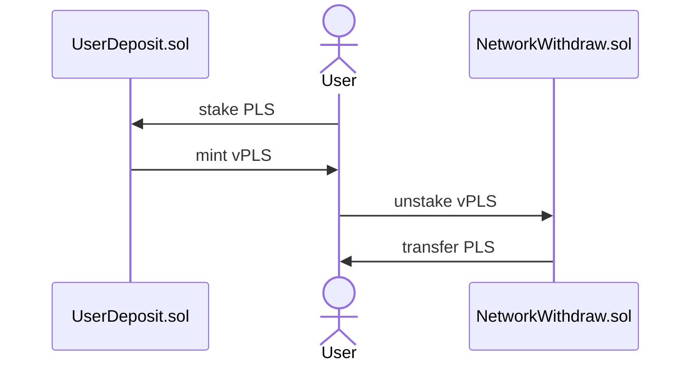
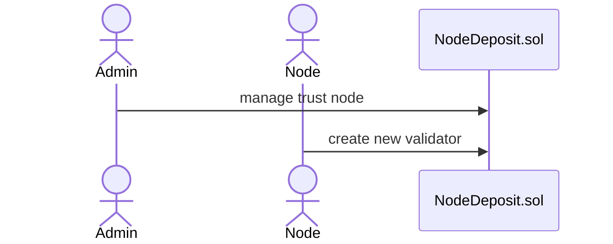
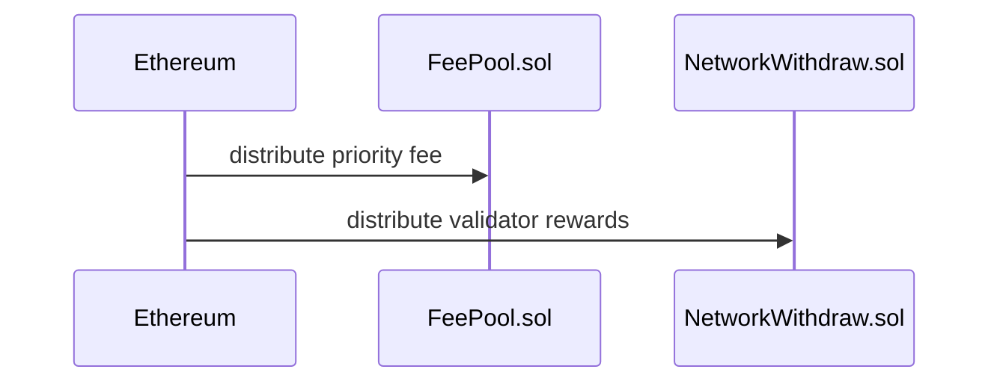
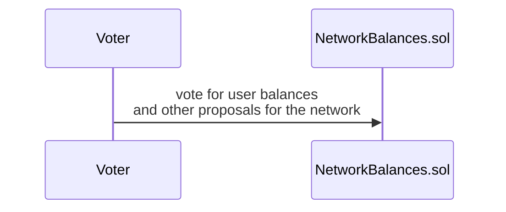

# pls-lsd-contracts

Contracts is the foundation of the Forked ETH LSD stack from StaFi. It consists of LsdToken, UserDeposit, NodeDeposit and NetworkWithdraw and other contracts, which enables users to stake, unstake and withdraw, validators to run nodes with minimum amount of PLS and platform to manage solo and trust nodes. 

To learn more about PLS LSD stack, see [**Vouch LSD Documentation and Guide**](https://vouch.run)

a very brief diagrams of the workflow:

## License

The primary license for ETH LSD Contracts is the Business Source License 1.1 (BUSL-1.1), see [LICENSE](./LICENSE). Minus the following exceptions:

- Some [libraries](./contracts/libraries/) and [interfaces](./contracts/interfaces/) have a GPL license

Each of these files states their license type.
